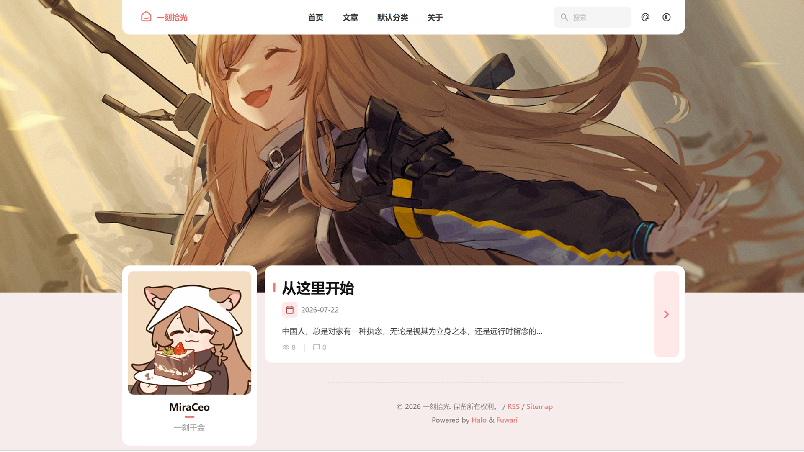

<h1 align="center">Halo Theme Fuwari MiraCeo</h1>

---

<div align="center">

一款适用于 [Halo 2](https://github.com/halo-dev/halo) 的博客主题。<br />
本项目是 [Jiewenhuang/halo-theme-fuwari](https://github.com/jiewenhuang/halo-theme-fuwari) 的维护分支，由 MiraCeo 修改和维护；原 Halo 主题移植自 [saicaca/fuwari](https://github.com/saicaca/fuwari)。

</div>

<p class="badge-row" align="center">
  <a href="https://halo.run" target="_blank">
    
  </a>
  <a href="https://github.com/MiraCeo/halo-theme-fuwari/releases" target="_blank">
    
  </a>
  <a href="https://github.com/MiraCeo/halo-theme-fuwari/blob/main/LICENSE" target="_blank">
    
  </a>
</p>

## v2.1.4 更新

相较于 v2.1.3，本版本重做音乐播放器的音源与配置方式，并修复若干交互与无障碍问题：

- **音乐独立为「音乐」设置标签页**。此前音乐是"侧边栏部件"之一，必须先在侧边栏添加音乐部件、再进入条目弹窗才能配置，且音量、自动播放这类站点级选项被复制在每个部件上。现在整站只有一份音乐配置。
- **播放器全站唯一**。顶栏按钮与侧边栏面板是同一个播放器的两个界面，共享播放状态。可用两个开关分别决定是否显示顶栏按钮、是否在侧边栏显示面板；关闭侧边栏面板时播放器仍在运行。
- **移除失效的默认音乐 API**。原先内置的默认 Meting 镜像 `api.i-meto.com` 已停止服务，继续使用它会导致音乐控件始终加载失败。现在不再内置任何第三方地址。
- **新增"自定义曲目列表"音源**。可把音频和封面上传到 Halo 附件，然后在主题设置里填写 JSON 列表，直接播放自己的音频，不再依赖任何第三方服务。
- **新增顶栏音乐按钮**。浏览器通常只允许有过交互的访客自动播放，首次访问必须手动开始，因此在导航栏右上角提供播放/暂停按钮，图标随真实播放状态切换。
- **新增自动播放开关**（默认关闭）。
- 音乐未启用时不再渲染任何音乐界面，"加载失败"与"未配置"不再混淆。
- 歌词改为可选且默认关闭；曲目没有歌词时歌词按钮不再出现。
- 曲目只有一首时不显示播放列表按钮。
- 修复歌词与音频不同步的并发问题：切换曲目后，上一首的歌词不会再覆盖当前曲目。
- 修复自动播放被浏览器拦截时产生的未处理错误。
- 音量容器与进度条支持键盘操作；移除会干扰读屏的时间读数播报。
- 修复深色模式下播放模式指示色不可见的问题。

> **关于早期 2.1.4 构建的白屏问题**：最初的 2.1.4 构建在顶栏音乐按钮中使用了 Halo 模板引擎无法求值的表达式，而模板是服务端渲染的，导致整个页面渲染失败。该构建已被本版本替换，请使用当前发布的 2.1.4 压缩包。
>
> 同时修复了友情链接页的既有缺陷：分组标题的空判断与 `th:each` 写在同一元素上，而 Thymeleaf 先执行 `th:each`，导致空分组仍会渲染出标题。

> **从旧版本升级**：音乐配置会重置。旧版把音乐设置存放在侧边栏的音乐部件里，本版本改为读取「音乐」标签页，不会迁移旧值。若此前配置过音乐，请在「音乐」标签页重新填写，并把侧边栏里的音乐部件删除（该选项已不存在）。

## v2.1.3 更新

相较于 v2.1.2，本版本聚焦兼容性、可访问性和资源优化，不包含视觉风格重做：

- 重构主题配色变量，使任意 RGB/HEX 颜色的红、绿、蓝通道都能参与完整界面配色，不再只提取色相。
- 修复无效的 Material Symbols 图标名称，消除构建时的图标警告。
- 修复图片组件的 `alt` 属性覆盖问题，并为主题图片补充更合理的加载优先级、懒加载与异步解码。
- 将内置 Roboto 字体精简为实际使用的 Latin 字重，减少字体资源体积；新增系统字体、Roboto、衬线、等宽和自定义字体选项。
- 优化图片懒加载、异步解码和首屏横幅加载优先级；默认头像、横幅和主题预览图保留原始 PNG/JPG 格式。
- 完善访客端取色器的简体中文、繁体中文和英文文本，增加焦点样式、状态提示及键盘方向键操作。
- 支持 `prefers-reduced-motion`，为偏好减少动态效果的访问者关闭平滑滚动并显著缩短动画和过渡。

> 自定义字体可在主题设置中填写 CSS `font-family`，也可以按需填写字体样式表 URL。外部字体的可用性、性能和隐私策略由所填写的资源服务决定。

## v2.1.2 更新

相较于 v2.1.1，本版本包含以下更新：

- 重做访客端主题色选择面板，使用饱和度/明度面板与色相滑块直接选择颜色，并实时显示当前 HEX 色值。
- 增加 RGB 与 HEX 输入模式切换：RGB 模式可分别编辑 R、G、B 通道，HEX 模式支持 `#RGB`、`RGB`、`#RRGGBB` 和 `RRGGBB`。
- 增加基于浏览器原生 [EyeDropper API](https://developer.mozilla.org/docs/Web/API/EyeDropper_API) 的屏幕吸管，并让取色器、RGB/HEX 输入和主题色状态保持同步。
- 访客自定义颜色改为以 HEX 格式独立存储；重置按钮可清除访客选择并恢复后台配置的默认主题色。
- 调整后台基础设置的排列顺序；自定义导航栏标题默认为空，未启用或未填写时显示网站标题。
- 更新个人资料的默认昵称和简介，并更新主题封面与首页预览图。

> 屏幕吸管需要在 HTTPS 环境中使用，并取决于浏览器对 EyeDropper API 的支持；不支持时仍可使用可视化取色器或 RGB/HEX 输入框。

## 本分支更新

- 将 Halo 主题唯一标识改为 `theme-fuwari-miraceo`，可与原版 `theme-fuwari` 同时安装，更新本分支时不会覆盖原主题。
- 独立主题设置、ConfigMap、静态资源路径和编辑器 UI 插件绑定，避免两个主题共享配置或错误加载资源。
- 后台主题颜色支持 `#RGB`、`#RRGGBB` 和 `rgb(r, g, b)` 格式；访客显示设置提供可视化取色、RGB/HEX 输入切换和原生屏幕吸管。
- 保留对旧版后台数字 `hue` 配置的兼容；颜色输入无效时会安全回退到旧配置或默认值。
- 更新主题元数据、仓库链接和页脚链接，由 MiraCeo 继续维护。

## 预览



## 安装

从当前仓库的 [Releases](https://github.com/MiraCeo/halo-theme-fuwari/releases) 下载主题压缩包，然后在 Halo Console 的主题管理页面上传安装。该分支会作为 `theme-fuwari-miraceo` 独立安装，不会覆盖原版 `theme-fuwari`。升级后建议刷新浏览器缓存，以确保新的访客主题色面板资源生效。

## 插件支持

Fuwari 主题支持以下 Halo 插件：

- [x] 搜索插件：https://www.halo.run/store/apps/app-DlacW
- [x] 评论插件：https://www.halo.run/store/apps/app-YXyaD
- [x] 瞬间插件：https://www.halo.run/store/apps/app-SnwWD
- [x] 图库插件：https://www.halo.run/store/apps/app-BmQJW
- [x] 链接管理插件：https://www.halo.run/store/apps/app-hfbQg

## 使用说明

> 1、部分功能是使用插件进行支持

- [x] 卡片化设计
- [x] 响应式主题
- [x] 深色模式
- [x] 文章目录
- [x] [代码高亮/语言/复制](https://github.com/halo-sigs/plugin-shiki)（插件）
- [x] [文章搜索](https://github.com/halo-sigs/plugin-search-widget)（插件）
- [x] [评论系统](https://github.com/halo-sigs/plugin-comment-widget)（插件）
- [x] [友情链接](https://github.com/halo-sigs/plugin-links)
- [x] 图库（/photos）：https://halo.run/store/apps/app-BmQJW
- [x] 瞬间（/moments）：https://halo.run/store/apps/app-SnwWD
- [x] 文章目录
- [x] i18n国际化
- [x] 其他功能

## 开发

```bash
git clone https://github.com/MiraCeo/halo-theme-fuwari.git
cd halo-theme-fuwari
```

```bash
pnpm install
```

```bash
pnpm dev
```

## 贡献

如需反馈当前维护分支的问题或参与改进，请前往本仓库：

- [提交 Issue](https://github.com/MiraCeo/halo-theme-fuwari/issues)
- 提交 Pull Request

<br>

## 致谢与来源

本项目建立在以下开源项目和作者的工作之上：

- [Jiewenhuang/halo-theme-fuwari](https://github.com/jiewenhuang/halo-theme-fuwari)：本维护分支直接基于该 Halo 主题修改。感谢 Jiewenhuang 完成移植与持续开发。
- [saicaca/fuwari](https://github.com/saicaca/fuwari)：原始 Astro Fuwari 主题。感谢 saicaca 的设计与实现。
- [Halo](https://halo.run)：主题运行平台及相关开发能力。

同时感谢下列 Halo 插件项目提供的功能支持：

- [plugin-links](https://github.com/halo-sigs/plugin-links)
- [plugin-comment-widget](https://github.com/halo-sigs/plugin-comment-widget)
- [plugin-search-widget](https://github.com/halo-sigs/plugin-search-widget)

本分支遵循原项目的 [MIT License](./LICENSE)。原项目已有的版权声明与许可证内容均予以保留；本分支的维护者信息不代表对原作者身份或版权归属的替代。

## 原项目相关资源

以下资源由原项目作者提供，可能与本维护分支的支持范围不同：

- [原项目预览：Jiewen's Blog](https://www.jiewen.run/?preview-theme=theme-fuwari)
- 原项目 QQ 交流群：929708466
- [TinyTale Halo 2 配套小程序](https://www.jiewen.run/archives/TinyTale-formal-edition)


